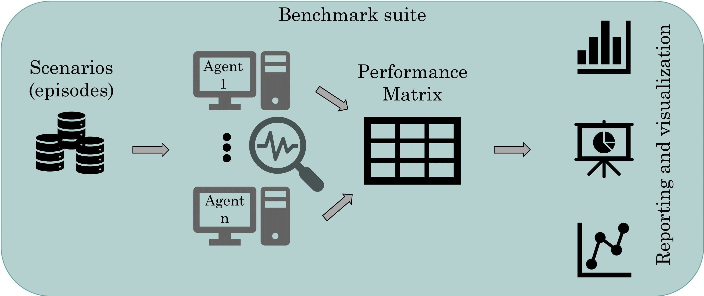

# Grid2Bench
The benchmarking framework allows to evaluate the performances of power grid based agents, from various point of views. The scheme of the framework is shown in Figure below. Different power grid episodes could be imported for the analysis purpose alongside the evaluation results of various agents. The KPIs (discussed [here](#main-features-of-rlbenchplot)) are computed which form a evaluation matrix or table. Finally, in order to facilitate the analysis and decision-making task, a series of visualization tools can be used to compare the performances.



*   [1 Installation](#installation)
    *   [1.1 Setup a Virtualenv (optional)](#setup-a-virtualenv-optional)
    *   [1.2 Install using Poetry](#install-using-poetry)
    *   [1.3 Install from PyPI](#install-from-pypi)
*   [2 Main features of RLBenchPlot](#main-features-of-rlbenchplot)
*   [3 Getting Started](#getting-started)
*   [4 Documentation](#documentation)
*   [5 License information](#license-information)

# Installation
## Requirements:
*   Python >= 3.7

## Setup a Virtualenv (optional)
### Create a virtual environment 
```commandline
mkdir my-project-folder
cd my-project-folder
pip3 install -U virtualenv
python3 -m virtualenv venv_grid2bench
```
### Enter virtual environment
```commandline
source venv_grid2bench/bin/activate
```

## Install using poetry
```commandline
git clone https://github.com/seifou23i/Grid2Bench.git
cd RLBenchPlot
pip install poetry
poetry install
```

## Install from PyPI
In future 
```commandline
pip3 install grid2bench
```

# Main features of Grid2Bench
This package allows to evaluate the performance of power grid agents from various point of views. 
Hereafter, we introduce the main feeatures included in this package:

- Cumulative rewards: 
- Agent's alive time:
- Action impacts
   - Lines:  
      - frequency per substation:
      - frequency per overloaded lines:
      - frequency per disconnected lines:
   - Reference topology:
   - Substations:    
- Action Execution Time
- Action Sequence length
- Agents bahaviour analysis

# Usage
An example of how to use the library is provided below:

```python
from grid2bench.AgentsAnalytics import AgentsAnalytics

# parent directory for agents log files
input_data_path = os.path.abspath("../data/input")

# Loading agents and required episodes
agents = AgentsAnalytics(
        data_path=input_data_path,
        agents_names= ["PPO_Agent", "MazeRL_Agent"],
    )

# Visualize the cumulative reward for all agents
agents.plot_cumulative_reward(agents_results)
```

A more complete example of all the functionalities could be seen in documentation: [Example](docs/source/examples.rst)

# KPI
A dedicated KPI page is provided at: [KPI page](docs/source/kpi.rst)

# Getting Started
Some Jupyter notebook are provided as tutorials for the Grid2Bench package. They are located in the 
[getting_started](getting_started) directories. 

Getting_Started notebook contains simple examples to show how we use the functions defined in the framework:

<!--   * Loading agent results- fot this part there are 2 options:
      * First option: you can load agent's resulsts separately [using EpisodeData class]
      * Second Option: you can load all the agents' results at onece [using AgentsAnalytics class]
   * Action Frequency
   * Impact of actions on objects 
   * Action Execution Time
   * Action Sequence length
   * Agents bahaviour analysis -->


   

# Documentation
The documentation is accessible from [here](https://grid2bench.readthedocs.io/en/latest/index.html).

To generate locally the documentation:
```commandline
pip install sphinx
pip install sphinx-rtd-theme
cd docs
make clean
make html
```

# To contribute
* Supplementary features could be requested using github issues. 
* Other contributions are welcomed and can be integrated using pull requests.

# License information
Copyright 2022-2023 IRT SystemX & RTE

    IRT SystemX: https://www.irt-systemx.fr/
    RTE: https://www.rte-france.com/

This Source Code is subject to the terms of the Mozilla Public License (MPL) v2 also available 
[here](https://www.mozilla.org/en-US/MPL/2.0/)
