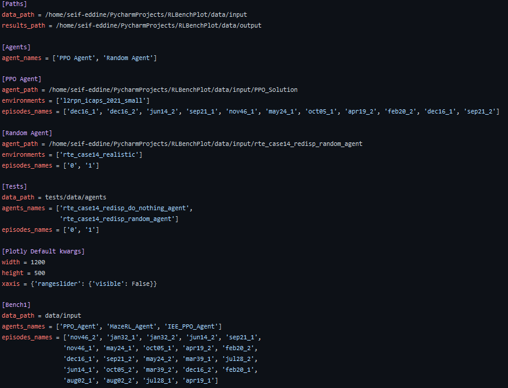

Benchmark Configuration
=======================
In order to give more flexibility to the user for parameterization of the platform and to be
able to define some default benchmark configurations, we have made use of a configuration file
in this project. This configuration is only used in notebook to retrieve existing benchmark
specific information for now. An example of this configuration file can be seen below:

As can be seen, the config file comprises various sections, where each section is designed for
a specific  use. The mostly used paths such as the path where the data is stored “data_path”
and the path where the results should be stored “results_path” are configured under the “paths”
section.

Afterwards, the user could define manually the agents that should be considered under the
“Agents” section or furthermore to designate them under the a benchmark section as “Bench1”
alongside the episode names which should be considered in analysis.
The user could also manipulate the plots configurations using the parameters under the “Plotly
Default kwargs” section. For example, the heights and weights of the plots could be adjusted if
required.

Finally, a test section is considered only for developments and testing purposes, where two
simple agents are used to confirm the different functionalities offered by the platform.

The config file could be managed using a helper function called “ConfigManager” which simplifies
the usage of python “ConfigParser”.

An usage example
----------------
We need to load the config parameters by giving the path to the config file at the first place:

.. code-block:: python

    from configmanager.configmanager import ConfigManager
    # config file name and path
    conf_path = os.path.abspath("../conf.ini")
    conf = ConfigManager(benchmark_name='Bench1', path=conf_path)

Once, the config file is imported correctly, its parameters could be accessed easily as shown below:

.. code-block:: python

    #Initialization of parameters for benchmarking 1
    input_data_path = os.path.abspath(os.path.join('..', conf.get_option('data_path')))
    agents_names = conf.get_option_tolist('agents_names')
    episodes_names = conf.get_option_tolist('episodes_names')