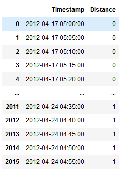
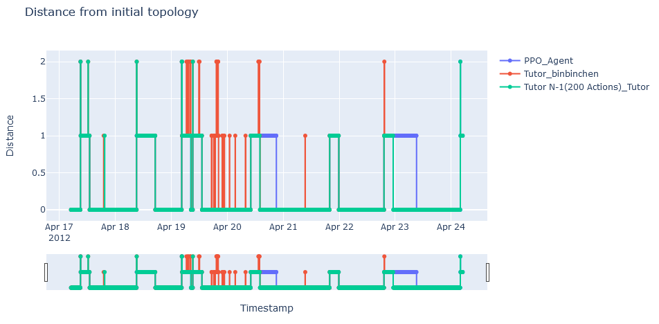

Contribution
============
This section can be considered as a guide for the ones who are interested in contributing and develop more capabilities based on the framework.

These contributions could be considered in different levels:

1. Performance Matrix
----------------------
This step comprises the data extraction (episodes) from performed agents’
results and their preparation as a dataframe by computing some metrics of interest. To prepare the
performance matrix and gather all the information required by a specific KPI, more than one
preliminary function may be used. These functions are available in ``EpisodeDataExtractor`` which
includes the information at episode level. Furthermore, the ``EpisodesDataTransformer`` include the
information for multiple episodes as dataframes for an agent which are finally used by
``AgentsAnalytics`` for for visualization and using also multiple agents.

To better understand this step, we use an illustrative example which has been used to plot the
distance from the reference topology. This matrix (dataframe) is constructed using
``distance_from_initial_topology`` function of ``EpisodesDataTransformer`` class for multiple episodes.

.. code-block:: python

    def distance_from_initial_topology(self, episodes_names: Optional[
        List] = None) -> pd.DataFrame:
        """Number of changes compared to initial topology at each timestamp
        for all episodes in episodes_names.

        If episodes_names=None, then returns the results of all loaded episodes.

        :param episodes_names: filter specific episodes. If none, returns results
            for all loaded episodes.
        :type episodes_names: list of str
        :return: distance from initial topology at each timestamp
        :rtype: DataFrame

        Example of usage:

        .. code-block:: python

        from grid2bench.EpisodesDataTransformer import EpisodesDataTransformer

        agent_log_path = '../data/input/Expert_Agent'
        episode_names = ['dec16_1', 'dec16_2']

        # loading episodes data
        expert_agent = EpisodesDataTransformer(agent_log_path, episode_names)

        # filter selected episodes, if episodes_names == default value then
        # return results from all loaded episodes
        episodes_names = ['dec16_1']
        df = expert_agent.distance_from_initial_topology(
                    episodes_names=['dec16_1'])
        print('Distance from initial topology for dec16_1 episode \\n', df)

        """

        if not episodes_names: episodes_names = self.episodes_names

        x = []
        y = []

        for episode_data in self.episodes_data:
        if episode_data.episode_name in episodes_names:
            for j in range(episode_data.n_action):
            act = episode_data.actions[j]
            obs = episode_data.observations[j]

            line_statuses = episode_data.observations[j].line_status
            # True == sub has something on bus 2, False == everything on bus 1
            # Distance for subs == subs_on_bus2.sum()
            subs_on_bus_2 = np.repeat(False, episode_data.observations[j].n_sub)
            # objs_on_bus_2 will store the id of objects connected to bus 2
            objs_on_bus_2 = {id: [] for id in
                            range(episode_data.observations[j].n_sub)}
            distance, _, _, _ = episode_data.get_distance_from_obs(act,
                                                                    line_statuses,
                                                                    subs_on_bus_2,
                                                                    objs_on_bus_2,
                                                                    obs)

            x.append(episode_data.timestamps[j])
            y.append(distance)

        df_distance = pd.DataFrame(data=np.array([x, y]).transpose(),
                                columns=['Timestamp', 'Distance'])

        df_distance = df_distance.sort_values(by='Timestamp', ascending=True)
        df_distance = df_distance.astype({'Distance': int}, errors='raise')

        return df_distance

However, the core function to compute this distance is present in ``EpisodeDataExtractor`` which compute
the distance from the reference topology for one episode.

.. code-block:: python

    def get_distance_from_obs(self, act, line_statuses, subs_on_bus_2,
                            objs_on_bus_2, obs):
        """Calculate the number of changes compared to the initial topology

        A function reused from grid2vis package (
        https://github.com/rte-france/grid2viz)

        :param act: the agent's action
        :type act: grid2op.BaseAction object
        :param line_statuses: line status (connected/disconnected)
        :type line_statuses: list
        :param subs_on_bus_2: substation connected on buses 2
        :type subs_on_bus_2: list
        :param objs_on_bus_2: objects connected on buses 2
        :type objs_on_bus_2: list
        :param obs: observation
        :type obs: grid2op.BaseObservation
        :return: distance, line_statuses, subs_on_bus_2, objs_on_bus_2
        :rtype: tuple
        """

        impact_on_objs = act.impact_on_objects()

        # lines reconnections/disconnections
        line_statuses[
        impact_on_objs['force_line']['disconnections']['powerlines']] = False
        line_statuses[
        impact_on_objs['force_line']['reconnections']['powerlines']] = True
        line_statuses[impact_on_objs['switch_line']['powerlines']] = np.invert(
        line_statuses[impact_on_objs['switch_line']['powerlines']])

        topo_vect_dict = {'load': obs.load_pos_topo_vect,
                        'generator': obs.gen_pos_topo_vect,
                        'line (extremity)': obs.line_ex_pos_topo_vect,
                        'line (origin)': obs.line_or_pos_topo_vect, }

        # Bus manipulation
        if impact_on_objs['topology']['changed']:
        for modif_type in ['bus_switch', 'assigned_bus']:

            for elem in impact_on_objs['topology'][modif_type]:
            objs_on_bus_2 = self.update_objs_on_bus(objs_on_bus_2, elem,
                                                    topo_vect_dict,
                                                    kind=modif_type)

        for elem in impact_on_objs['topology']['disconnect_bus']:
            # Disconnected bus counts as one for the distance
            subs_on_bus_2[elem['substation']] = True

        subs_on_bus_2 = [True if objs_on_2 else False for _, objs_on_2 in
                        objs_on_bus_2.items()]

        distance = len(line_statuses) - line_statuses.sum() + sum(subs_on_bus_2)
        return distance, line_statuses, subs_on_bus_2, objs_on_bus_2

    # function reused from grid2vis, see https://github.com/rte-france/grid2viz
    def update_objs_on_bus(self, objs_on_bus_2, elem, topo_vect_dict, kind):
        for object_type, pos_topo_vect in topo_vect_dict.items():
        if elem['object_type'] == object_type and elem['bus']:
            if kind == 'bus_switch':
            objs_on_bus_2 = self.update_objs_on_bus_switch(objs_on_bus_2, elem,
                                                            pos_topo_vect)
            else:
            objs_on_bus_2 = self.update_objs_on_bus_assign(objs_on_bus_2, elem,
                                                            pos_topo_vect)
            break
        return objs_on_bus_2

This matrix for a given episode (``Apr19_2``) looks like this:

To suggest any new functionality, it implies to add two functions at episode and at the agent level in
``EpisodeDataExtractor`` and ``EpisodesDataTransformer`` respectively.

2. KPI development
------------------
Once the dataframe or performance matrix is prepared in last step for a specific
metric, this new KPI could be demonstrated using visualization tools for a better understanding of
agent’s behavior. To do this, corresponding function should be implemented in ``AgentsAnalytics``.

Taking the same example provided in performance matrix step, the corresponding visualization function is
called ``plot_distance_from_initial_topology`` and is available in ``AgentsAnalytics`` class. This function
takes as argument the agent(s) result(s) and episode name(s) and allows to visualize the corresponding plot
by using the dataframe created from last steps.

.. code-block:: python

    def plot_distance_from_initial_topology(
      agents_results: List[EpisodesDataTransformer],
      episodes_names: Optional[List] = None,
      title: str = 'Distance from initial topology', **fig_kwargs):
        """line chart representing the number of changes compared to the initial
        topology at each timestamp and for each agent.

        You can filter the agents to display by giving the list "agents_results"
        only to the desired agents.

        Similarly, you can filter the episodes by giving the "episode_names" list
        only to the episodes you want to display. If episodes_names=None,
        then  returns the results of all loaded episodes.

        :param agents_results: list of agents episodes log, each item is a list
                            of episode logs for an agent.
        :type agents_results: list of :class:`EpisodeDataTransformer`
        :param episodes_names: filter specific episodes. If none, returns results
                            for all loaded episodes.
        :type episodes_names: list of str
        :param title: bar chart title, bar chart title, default value =
                    'Distance from initial topology'
        :type title: str
        :param fig_kwargs: keyword arguments from the plotly library. Example:
                        height= 700. For more arguments vist the plotly
                        documentation https://plotly.com/python/
        :type fig_kwargs: **kwargs
        :return: Time series line graph of actions execution times
        :rtype: plotly figure

        Example of usage:

        .. code-block:: python

        import os
        from grid2bench.AgentsAnalytics import AgentsAnalytics

        input_data_path = os.path.abspath('../data/input')
        agents_names = ['Expert_Agent', 'IEE_PPO_Agent']
        episodes_names = ['dec16_1', 'dec16_2']

        # loading data
        agents = AgentsAnalytics(
            data_path=input_data_path,
            agents_names=agents_names,
            episodes_names=episodes_names
        )

        agents_logs = agents.agents_data

        fig = AgentsAnalytics.plot_distance_from_initial_topology(
                agents_logs,
                episodes_names=['dec16_1'])
        fig.show()

        """

        # for the first agent
        agent_names = [agents_results[0].agent_name]
        df = agents_results[0].distance_from_initial_topology(episodes_names)
        df = df.rename(columns={'Distance': agents_results[0].agent_name})

        for agent in agents_results[1:]:
        agent_names.append(agent.agent_name)
        df2 = agent.distance_from_initial_topology(episodes_names)
        df2 = df2.rename(columns={'Distance': agent.agent_name})

        df = df.join(df2.set_index('Timestamp'), on='Timestamp')

        # Create traces
        fig = go.Figure()

        for agent_name in agent_names:
        fig.add_trace(
            go.Scatter(x=df['Timestamp'].tolist(), y=df[agent_name].tolist(),
                    mode='lines+markers', line_shape='hvh', name=agent_name))

        fig.update_layout(xaxis={'rangeslider': {'visible': True}}, title=title,
                        xaxis_title='Timestamp', yaxis_title='Distance')
        fig.update_layout(**fig_kwargs)

        return fig

using this KPI function, we obtain the following plot for a given episode ``Apr19_2``:

Don't hesitate to open new issues on our github page for any questions or suggestions.
