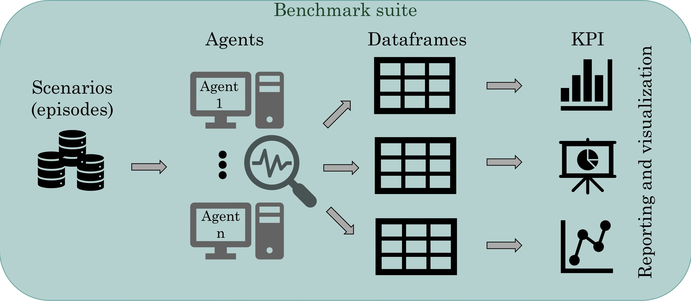

Introduction
============
The benchmarking platform Grid2Bench helps the power grid community to evaluate
their operating agents and to compare their performances, which in turn helps in
decision-making.

This package allows to evaluate the performance of power grid agents from various point of views.
Hereafter, we introduce the main feeatures included in this package:

- Cumulative rewards
- Agent's alive time
- Action impacts
   - Frequency of actions per substation
   - frequency of actions per overloaded lines
   - frequency of actions per disconnected lines
   - Actions impacting the Reference topology
   - Actions impacting Substations
- Action Execution Time
- Action Sequence length
- Agents bahaviour analysis

Motivation
----------
The motivation for the development of Grid2Bench was initially to be able to
benchmark L2RPN competition agents against the improvement reached by adding
more complex action spaces.

Limitation
----------
Limitations are :

----------

Installation
------------
Requirements
*************
Python >= 3.7

Setup a Virtualenv (optional)
*****************************
Create a virtual environment
~~~~~~~~~~~~~~~~~~~~~~~~~~~~~
.. code-block:: bash

    mkdir my-project-folder
    cd my-project-folder
    pip3 install -U virtualenv
    python3 -m virtualenv venv_grid2bench

Enter virtual environment
~~~~~~~~~~~~~~~~~~~~~~~~~
.. code-block:: bash

    source venv_grid2bench/bin/activate

Install using poetry
**********************
.. code-block:: bash

    git clone https://github.com/seifou23i/Grid2Bench.git
    cd RLBenchPlot
    pip install poetry
    poetry install

Install from PyPI
*****************
In future

.. code-block:: bash

    pip3 install grid2bench