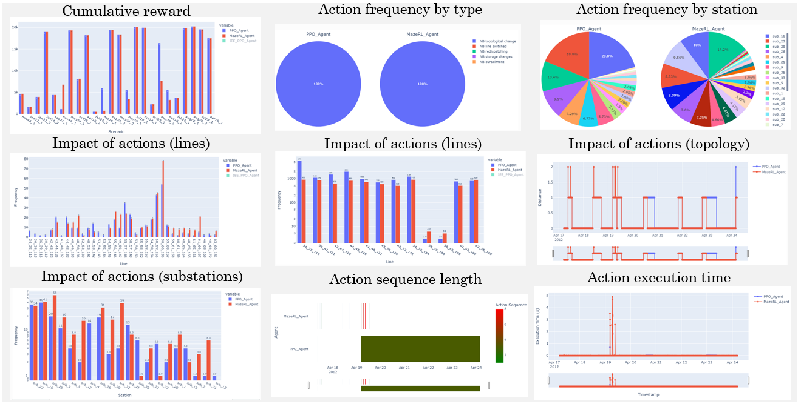
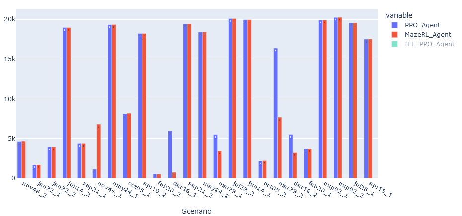
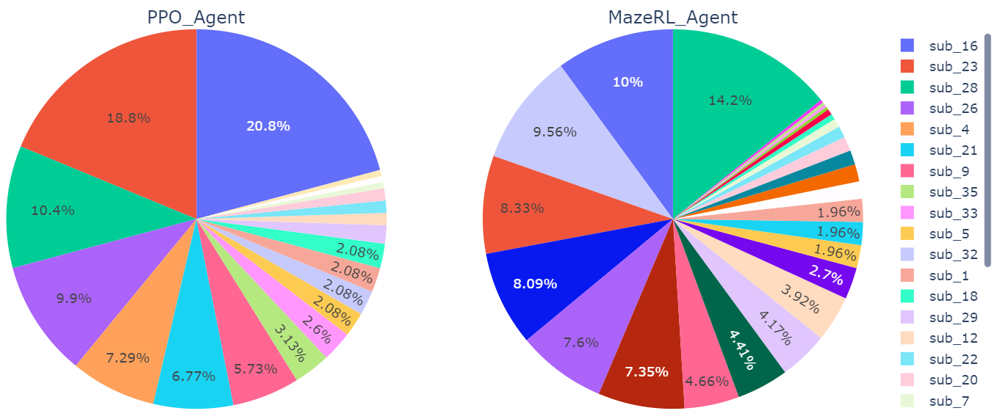
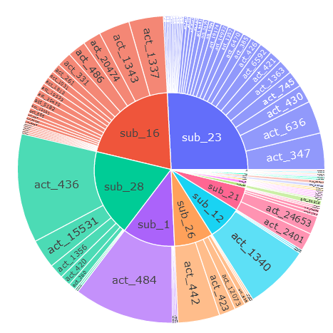
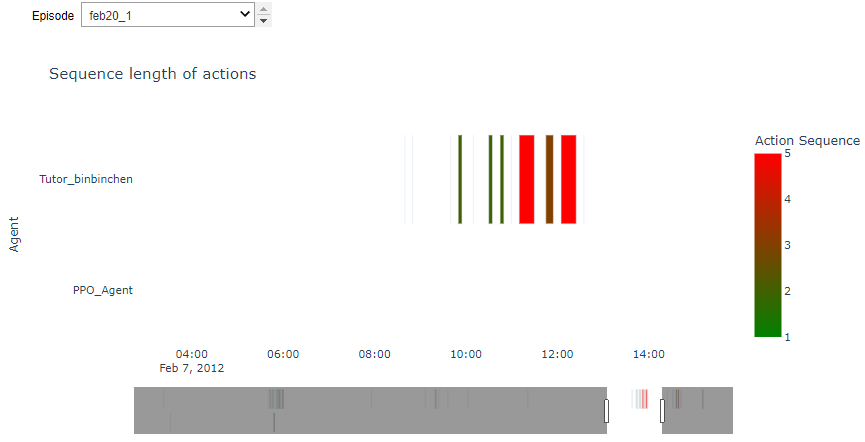

***
KPI
***

Introduction
============
This section show how to use the KPI module. Various examples are provided with correspnding
code snippet to show different functionalities. The figure below show all the capabilities at
a glance.

Configuration and Inputs
========================
The agents required for analysis should be imported at the first stage.
The following code snippet shows how to load different agents:

.. code:: python

    from grid2bench.AgentsAnalytics import AgentsAnalytics

    agents = AgentsAnalytics(
        data_path=input_data_path,
        agents_names= ["PPO_Agent", "MazeRL_Agent"],
    ) #  episodes_names= ['dec16_1', 'dec16_2']

Available KPI
=============

Cumulative rewards and accomplished time steps
----------------------------------------------
We can visualized for each agent and for each episode the cumulative reward and
total survival time step that the agent accomplished. Figure below present such
results for *PPO_agent* and *MazeRL_agent*

.. code:: python

    # python code snippet to reproduce the figure
    agents.plot_cumulative_reward(agents_results)

.. code:: python

    agents.plot_cumulative_reward(agents_results, fig_type='AccTimeSteps')

.. image:: imgs/CumRewAccTimeSteps.png
    :align: center
    :alt: Cumulative Reward

Action frequencies
------------------
We can visualize the frequency of different actions for each agent. In figure below
we can see that in both agents below 100% of the actions are topology changes.

.. code:: python

    # python code snippet to reproduce the figure
    AgentsAnalytics.plot_actions_freq_by_type(
        agents.agents_data,
        col=2,
        title = "Frequency of actions based on action types"
    )

.. image:: imgs/ActFreq.png
    :align: center
    :alt: Cumulative Reward

Also action frequency can be visualized based on the substations,
pi-chart below shows for each agent the share of each station in all the performed actions.

.. code:: python

     # python code snippet to reproduce the figure
    AgentsAnalytics.plot_actions_freq_by_station_pie_chart(
        agents.agents_data,
        col=2,
        title = "Frequency of actions by station"
    )

Let's dig into more details about the impacted stations by viewing the id of the actions
that impact these stations

.. code:: python

    # Select an agent to see its actions per substation
    agent = agents.agent_data[agents.agents_names.index('Tutor_binbinchen')]
    # Retrieve the corresponding dataframe for a given agent
    df = tutor_binbinchen.get_actions_by_substation_by_id()
    # Plot it
    eps.plot_actions_by_station_by_id(
        df,
        title = 'Tutor Binbinchen : Frequency of actions by substation')

Impact of actions on objects
----------------------------
We can visualize the impacts of actions on different objects:

Impact on lines
~~~~~~~~~~~~~~~~
We can visualize overloaded lines and compare the results of different agents in a bar plot.
[Using function `plot_lines_impact()` if parameter `disconnected==False`,
then the function will plot overloaded lines].
Figure below presents the result of above function for overloaded lines:

.. code:: python

    # python code snippet to reproduce the figure
    AgentsAnalytics.plot_lines_impact(
        agents.agents_data,
        title = "Overloaded lines",
        yaxis_type = "linear"
    )

.. image:: imgs/ImpactOverLines.png
    :align: center
    :alt: Cumulative Reward

And for the same function with parameter `disconnected = True`,
we can have the visualization of disconnected lines.

.. code:: python

    # python code snippet to reproduce the figure
    AgentsAnalytics.plot_lines_impact(
        agents.agents_data,
        title = "Overloaded lines",
        fig_type = "disconnected"
    )

.. image:: imgs/ImpactDiscLines.png
    :align: center
    :alt: Cumulative Reward

Impact on reference topology
~~~~~~~~~~~~~~~~~~~~~~~~~~~~
We can also compute and compare the distance from the initial topology at
each time step of selected episode.

.. code:: python

    # python code snippet to reproduce the figure
    w = widgets.Dropdown(
            options=agents.episodes_names,

            description='Episode',
        )
    def f(x):
        display(AgentsAnalytics.plot_distance_from_initial_topology(agents_results,
                                                                    episodes_names=[x]))

    interact(f, x=w)

.. image:: imgs/ImpactTopo.png
    :align: center
    :alt: Cumulative Reward

Impact on substations
~~~~~~~~~~~~~~~~~~~~~~
In the same way as impact of actions on lines, we can visualized the impact
of actions on the substations. Figure below presents the frequency of action by
stations for two different agents.

.. code:: python

    # python code snippet to reproduce the figure
    AgentsAnalytics.plot_actions_freq_by_station(
        agents.agents_data,
        title = "Frequency of actions by station",
        yaxis_type = "log"
    )

.. image:: imgs/ImpactSubs.png
    :align: center
    :alt: Cumulative Reward

Action sequence length
----------------------
We can visualize the action sequence length with a widget to select the episode that we want to analyze:

.. code:: python

    # Graphic parameters
    min_length= 0
    max_length= 15
    bg = "rgba(0,0,0,0)"

    # function allowing to plot the action sequence length interactively
    def f(x):
        if not type(x)==list : eps = [x]
        else : eps =x

        display(agents.plot_actions_sequence_length(
            agents_results,
            episodes_names=eps,
            min_length=min_length,
            max_length=max_length,
            plot_bgcolor = bg
        )
            )

    interact(f, x=w)

