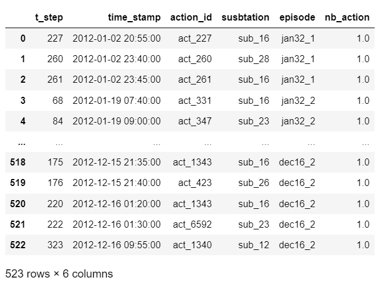
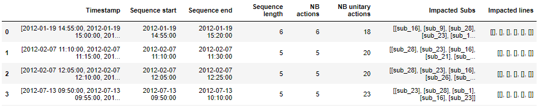
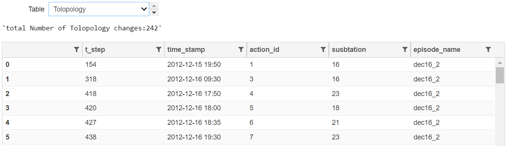
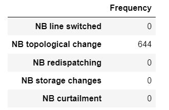
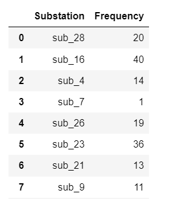
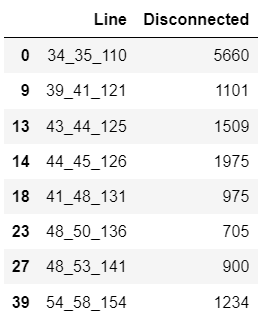
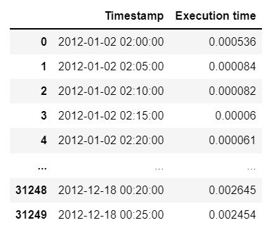
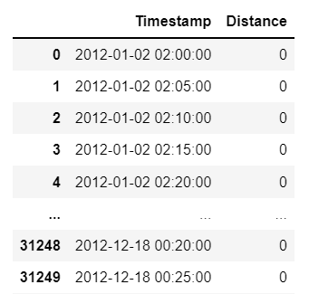

********************
Performance Matrices
********************

This section provides performance matrices (dataframes) which are used
by visualisation tools to plot the required performance metrics.

Action identifier by substation
-------------------------------
In addition, there are cases that we might be interested to verify which actions are mostly
performed for specific substations. The two level Pychart provides this possibility to
visualize the action_id for each substation. The corresponding dataframe can be retreived by:

.. code-block:: python

    df = agent_example.get_actions_by_substation_by_id()

Action sequence length
----------------------
We can also verify the sequence of actions as tabular data with the possibility of keeping
only the sequences between 5 and 10 for example:

.. code-block:: python

    min_length= 5
    max_length= 15

    agent_example.display_sequence_actions(
        min_length=min_length,
        max_length=max_length,
    )

Agent Behavior analysis
-----------------------
To analyze the behavior of agents in more details, sometime we need to have a detailed list
of different type of actions performed by the agent. Function ``get_detailed_action_types()``
returns for each agent and for listed episodes these detailed information.

.. code-block:: python

    EpisodeDataTransformer.display_datiled_action_type(agent_result, ["dec16_2", "dec16_1"])

The widget provides the possibility to choose the action type to focus on all the actions of
the same type and also the columns of the results have the filtering possibility in case we
want to filter the results based on specific substation or action_id.

Frequency of different action types
-----------------------------------

.. code-block:: python

    agent.actions_freq_by_type_several_episodes()

Frequency of actions by substations
-----------------------------------
.. code-block:: python

    agent.actions_freq_by_station_several_episodes()

Frequency of disconnected lines
-------------------------------

.. code-block:: python

    agent.disconnected_lines_freq_several_episodes()

Agent execution time
-------------------------------

.. code-block:: python

    agent.computation_times_several_episodes()

Distance fom initial topology
-------------------------------

.. code-block:: python

    agent.distance_from_initial_topology()

